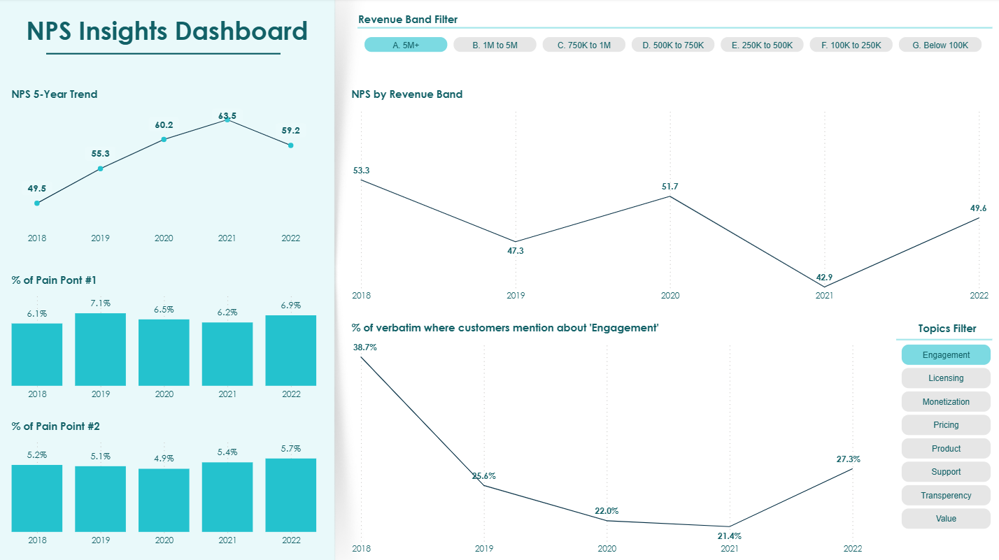

# CX Feedback Intelligence

**Automated NLP pipeline to analyze 35,000+ customer NPS survey responses - extracting sentiment, categorizing feedback into strategic topic areas, and surfacing actionable insights for senior leadership.**

> **Reference Implementation** - Production system deployed privately. This repo demonstrates architecture and design patterns only.

---

## About This Repository

I built and deployed the production version of this system in an enterprise environment. This repository is a sanitized reference implementation - it reflects the real architecture, design decisions, and engineering patterns, with proprietary business logic replaced by clean stubs and generalizations.

For questions about the production implementation or design decisions, feel free to connect on LinkedIn: [linkedin.com/in/kamal-manick](https://linkedin.com/in/kamal-manick)

---

## Problem Statement

Enterprise organizations collect thousands of NPS survey responses each year. Each response includes a numeric score (0-10) and a free-text comment explaining *why* the customer gave that score. The challenge is twofold:

**1. Manual review doesn't scale.**
With 35,000+ verbatim responses, manual categorization is tedious, time-consuming, and introduces reviewer bias - the same statement can be interpreted differently by different reviewers depending on their perspective and context. A comment like *"the platform is powerful but licensing is confusing"* might be tagged as "positive" by one reviewer and "negative" by another, depending on which clause they weight more heavily.

**2. NPS scores alone lack diagnostic power.**
A score of 6 tells you a customer is a detractor, but not *why*. Leadership needs to know which of their strategic initiatives - product quality, pricing, customer engagement, support - are driving dissatisfaction, so they can allocate resources to the areas that will move the needle.

**Context:** This system was designed and built in 2022, before the current generation of LLM-based tools became widely accessible. The architecture reflects deliberate engineering choices using classical NLP techniques (VADER, spaCy, pattern matching) to solve a problem that today might be approached differently - but the design patterns, trade-offs, and domain-tuning strategies remain highly relevant.

---

## Architecture Overview


See [ARCHITECTURE.md](ARCHITECTURE.md) for the full system design narrative and [docs/diagrams/](docs/diagrams/) for detailed Mermaid diagrams.

---

## Key Design Decisions

### 1. Custom Sentence Boundary Detection
**Trade-off:** Accuracy of per-clause analysis vs. processing complexity.

NPS comments are often multi-clause compound sentences: *"The product is great but support response times are terrible."* Default NLP sentence parsers treat this as one sentence, producing a blended sentiment score that masks the opposing signals. I injected custom boundaries on conjunctions (`however`, `but`) and punctuation (`;`, `,`) into the spaCy pipeline, splitting feedback into atomic statements that each receive independent sentiment and topic labels. This increases row count ~1.7x but dramatically improves categorization precision.

### 2. Asymmetric Polarity Scoring
**Trade-off:** Sensitivity to negative feedback vs. balanced representation.

VADER's default compound score tends to soften negative feedback - a clearly negative statement might score -0.3 (mild). For NPS analysis, *identifying pain points is the primary goal*, so I replaced the compound score with a custom scoring function that amplifies negative signals. If any negative component exists with zero positive, it returns -1 outright. This means the system over-indexes on negativity by design, which is exactly what leadership needs when deciding where to invest improvement effort.

### 3. Domain-Tuned Sentiment Lexicon
**Trade-off:** Maintenance overhead of a custom lexicon vs. accuracy in a specialized domain.

Generic sentiment models have no opinion about words like "licensing" or "implementation" - they're neutral in everyday language but carry strong connotation in enterprise software feedback. I built a custom lexicon overlay (~70 terms) that adjusts VADER's default scores for domain-specific vocabulary. This requires periodic maintenance as language evolves, but the accuracy gain over vanilla VADER was substantial - particularly for enterprise SaaS terminology.

### 4. Keyword Matcher Over Statistical Topic Modeling
**Trade-off:** Manual taxonomy curation vs. interpretability for business stakeholders.

I evaluated LDA and early BERTopic for topic extraction but rejected them because the resulting clusters were too abstract for leadership consumption. A cluster labeled "Topic 3: [license, cost, pricing, model]" requires interpretation; a label that says "pricing is bad" maps directly to the strategic initiative responsible. The keyword-based matcher (spaCy `Matcher` with lemma + exact patterns) produces deterministic, explainable results that leadership can act on without a data scientist in the room.

### 5. Typo, Abbreviation, and Misspelling Handling via Lexicon Mapping
**Trade-off:** Scalability of manual list vs. immediate coverage.

Customer feedback is full of typos ("flexability"), abbreviations ("OOB" for out-of-the-box), and misspellings ("Licensce", "reliablity"). Rather than implementing spell-correction (which can introduce its own errors), I mapped known variants directly into the keyword lexicon - each misspelling points to its correct category. This ensures topic extraction succeeds even on malformed input. The approach works well at moderate scale (~280 keywords) but becomes a maintenance burden as the corpus grows. See [Future Roadmap](#future-roadmap) for the planned improvement.

---

## Component Breakdown

| Layer | Module | Purpose |
|---|---|---|
| **Extraction** | `src/extraction/survey_client.py` | Interface for pulling survey responses from an external survey platform API |
| **Ingestion** | `src/ingestion/consolidator.py` | Merges multi-year exports, normalizes column schemas, filters blanks, decodes HTML entities |
| **NLP - Splitting** | `src/nlp/sentence_splitter.py` | Custom spaCy sentence boundary detection - splits compound sentences on conjunctions and punctuation |
| **NLP - Sentiment** | `src/nlp/sentiment_analyzer.py` | VADER with custom lexicon overlay and asymmetric polarity scoring |
| **NLP - Topics** | `src/nlp/topic_categorizer.py` | spaCy Matcher with keyword/lemma hybrid patterns for deterministic topic extraction |
| **NLP - Mapping** | `src/nlp/topic_sentiment_mapper.py` | Cross-references NPS score + text sentiment to produce directional topic labels |
| **Transformation** | `src/transformation/exporter.py` | Prepares structured output for BI consumption |
| **Config** | `src/config/` | Example category taxonomy and sentiment lexicon definitions |
| **Pipeline** | `src/pipeline.py` | End-to-end orchestrator tying all stages together |

---

## Tech Stack

| Technology | Role |
|---|---|
| Python 3.12 | Core language |
| pandas / numpy | Data manipulation and transformation |
| spaCy (`en_core_web_lg`) | NLP pipeline - tokenization, sentence parsing, lemmatization, NER, pattern matching |
| NLTK (VADER) | Sentiment intensity analysis with custom lexicon support |
| Power BI | Executive dashboard and visualization layer |
| Survey Platform API | Data source (NPS survey responses) |

---

## Insights Dashboard

The pipeline output feeds a Power BI dashboard that visualizes:
- Sentiment distribution by year and quarter
- Topic frequency breakdown (what customers talk about most)
- Directional topic analysis (which areas are "good" vs. "bad")
- Drill-down by region, segment, and account tier



> *The screenshot above uses synthetic data. The production dashboard processes 35,000+ real survey responses.*

See [docs/visuals/](docs/visuals/) for details on the dashboard design.

---

## Future Roadmap

### LLM-Based Topic Extraction and Sentiment Scoring
Replace the keyword-matcher and VADER pipeline with direct LLM inference (e.g., Claude, GPT-4) for both topic extraction and sentiment scoring. An LLM can understand context, sarcasm, and implicit meaning without requiring a manually curated keyword taxonomy - dramatically reducing maintenance overhead while improving accuracy on edge cases.

### Sarcasm and Implicit Negativity Detection
The current pipeline misclassifies sarcastic or conditionally negative feedback. For example:

> *"I would have been happier if your licensing model was transparent."*

VADER scores this as strongly positive (happy, transparent), but the actual intent is negative - the customer is saying licensing *lacks* transparency. A detection layer using part-of-speech analysis to identify subjunctive/conditional tense ("would have been") combined with positive sentiment words can flag these inversions. The POS pattern `MD + VB(perfect) + VBN(positive)` paired with a positive polarity score is a strong signal for sarcasm or implicit criticism.

### Scalable Typo and Variant Handling
The current approach maps known misspellings and abbreviations in a manually maintained keyword lexicon. This doesn't scale as the corpus grows and new variants appear. A future improvement would use fuzzy matching (e.g., Levenshtein distance, phonetic matching) or embedding-based similarity to automatically resolve typos to their canonical keyword - eliminating the manual maintenance loop while preserving deterministic category mapping.

---

## Learnings and Reflection

**Domain tuning matters more than model sophistication.** Vanilla VADER with a 70-word custom lexicon outperformed more complex approaches for this specific domain. The lesson: understand your data before reaching for a bigger model.

**Sentence-level granularity was the single highest-impact decision.** Splitting compound sentences into atomic statements transformed the quality of topic-sentiment pairing. A comment with mixed positive and negative feedback no longer produces a diluted "neutral" - each clause gets its own label.

**Deterministic beats probabilistic for stakeholder trust.** Leadership needed to understand *why* a comment was categorized a certain way. A keyword matcher with an explicit taxonomy was auditable in a way that LDA clusters never could be. When a categorization was wrong, I could trace it to a missing keyword and fix it in minutes.

**Asymmetric scoring is a product decision, not just a technical one.** Choosing to amplify negative signals was a deliberate alignment with the business objective - NPS improvement programs need to find and fix pain points, not celebrate what's already working. The scoring function encodes this organizational priority.

**Built in 2022, still relevant in 2025.** The core patterns - domain lexicon tuning, custom boundary detection, dual-signal categorization - are reusable regardless of whether the underlying model is VADER or an LLM. Architecture outlasts implementation.

---

## Architecture Decision Records

Detailed reasoning behind each major design choice:

- [ADR-001: Custom Sentence Boundaries](docs/adr/adr-001-custom-sentence-boundaries.md)
- [ADR-002: Enhanced Polarity Scoring](docs/adr/adr-002-enhanced-polarity-scoring.md)
- [ADR-003: Domain Lexicon Overlay](docs/adr/adr-003-domain-lexicon-overlay.md)
- [ADR-004: Dual-Signal Topic-Sentiment Mapping](docs/adr/adr-004-dual-signal-topic-sentiment.md)
- [ADR-005: Keyword Matcher Over Topic Modeling](docs/adr/adr-005-keyword-matcher-over-topic-modeling.md)
- [ADR-006: Typo and Abbreviation Handling](docs/adr/adr-006-typo-abbreviation-handling.md)

---

## Repository Structure

```
cx-feedback-intelligence/
├── README.md
├── ARCHITECTURE.md
├── requirements.txt
├── docs/
│   ├── adr/                        # Architecture Decision Records
│   ├── diagrams/                   # Mermaid system diagrams
│   └── visuals/                    # Dashboard screenshots (synthetic data)
├── src/
│   ├── pipeline.py                 # End-to-end orchestrator
│   ├── config/                     # Category taxonomy & lexicon definitions
│   ├── extraction/                 # Survey platform API client
│   ├── ingestion/                  # Data consolidation & cleaning
│   ├── nlp/                        # Sentence splitting, sentiment, topic extraction
│   └── transformation/             # Export preparation
└── examples/                       # Sample data files (synthetic)
```
