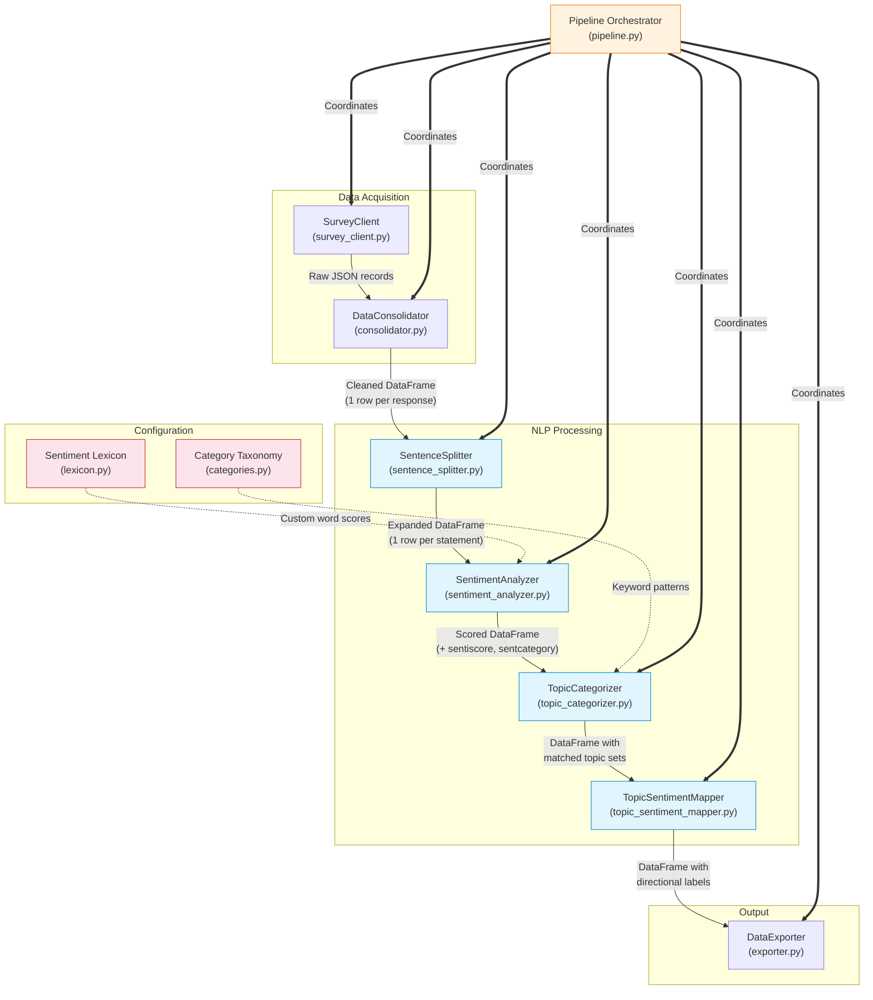

# Component Interaction Diagram

Shows how internal components of the pipeline interact with each other.

## Component Responsibilities

| Component | Input | Output | Key Dependency |
|---|---|---|---|
| SurveyClient | API credentials + date range | List of raw record dicts | Survey platform API |
| DataConsolidator | Raw JSON files | Cleaned, normalized DataFrame | pandas |
| SentenceSplitter | Comment text | List of (index, text) tuples | spaCy `en_core_web_lg` |
| SentimentAnalyzer | Statement text | Polarity score + category | NLTK VADER + custom lexicon |
| TopicCategorizer | Statement text | Set of matched categories | spaCy Matcher + keyword taxonomy |
| TopicSentimentMapper | Topics + sentiment + NPS score | Set of directional labels | Business rules |
| DataExporter | Labeled DataFrame | Excel/CSV files | openpyxl |
| Pipeline | Configuration | End-to-end execution | All components |
