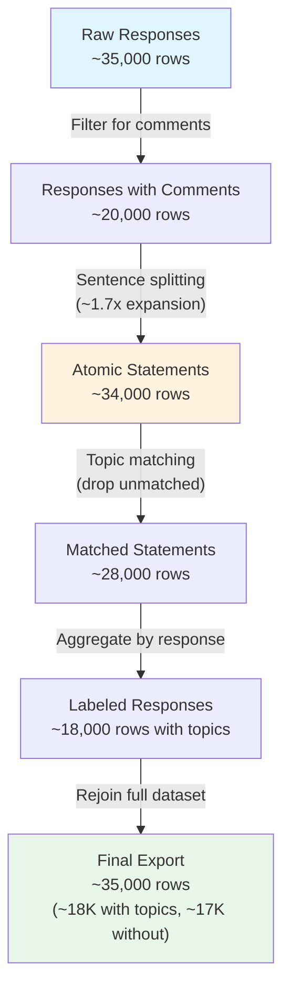

# Data Flow Diagram

Shows how data transforms as it moves through each pipeline stage.

```mermaid
graph LR
    subgraph "Stage 1: Extraction"
        A1["Survey Platform API"] -->|"JSON"| A2["Raw JSON Files<br/>~10K records/file"]
    end

    subgraph "Stage 2: Ingestion"
        A2 -->|"Load & merge"| B1["Consolidated DataFrame<br/>~35K rows"]
        B1 -->|"Filter non-blank<br/>comments"| B2["Comments DataFrame<br/>~20K rows"]
        B2 -->|"Clean HTML entities<br/>Normalize columns"| B3["Cleaned DataFrame"]
    end

    subgraph "Stage 3: Sentence Splitting"
        B3 -->|"spaCy custom<br/>boundaries"| C1["Atomic Statements<br/>~34K rows"]
    end

    subgraph "Stage 4: Sentiment"
        C1 -->|"VADER +<br/>custom lexicon"| D1["+ sentiscore<br/>+ sentcategory"]
    end

    subgraph "Stage 5: Topics"
        D1 -->|"spaCy Matcher<br/>keyword patterns"| E1["+ topic set<br/>{product, support, ...}"]
    end

    subgraph "Stage 6: Mapping"
        E1 -->|"NPS score ×<br/>text sentiment"| F1["+ directional labels<br/>{product is good, ...}"]
    end

    subgraph "Stage 7: Export"
        F1 -->|"Aggregate to<br/>response level"| G1["Final DataFrame<br/>~35K rows + topics"]
        G1 -->|"Write"| G2["Excel Export<br/>2 sheets"]
    end

    style A1 fill:#fff3e0
    style G2 fill:#e8f5e9
```

## Row Count Transformation

This diagram illustrates how the dataset size changes through the pipeline:

## Data Schema at Each Stage

### After Ingestion (Stage 2)
| Column | Type | Description |
|---|---|---|
| survey_date | datetime | Response timestamp |
| response_id | string | Unique response identifier |
| nps_score | int | NPS rating (0-10) |
| comment | string | Free-text feedback |
| nps_category | string | Promoter / Passive / Detractor |
| region | string | Geographic region |
| segment | string | Market segment |
| ... | ... | Additional demographic dimensions |

### After Sentence Splitting (Stage 3)
| Column | Type | Description |
|---|---|---|
| *(all above)* | | |
| statement_seq | int | Statement sequence within response |
| statement_text | string | Individual atomic statement |

### After Sentiment Analysis (Stage 4)
| Column | Type | Description |
|---|---|---|
| *(all above)* | | |
| sentiment_score | float | Enhanced polarity score [-1, +1] |
| sentiment_category | string | Very Negative / Negative / Mixed / Positive / Very Positive |

### After Topic-Sentiment Mapping (Stage 6)
| Column | Type | Description |
|---|---|---|
| *(all above)* | | |
| topics | set[str] | Matched categories (e.g., {"product", "support"}) |
| directional_topics | set[str] | Labeled topics (e.g., {"product is good", "support is bad"}) |
