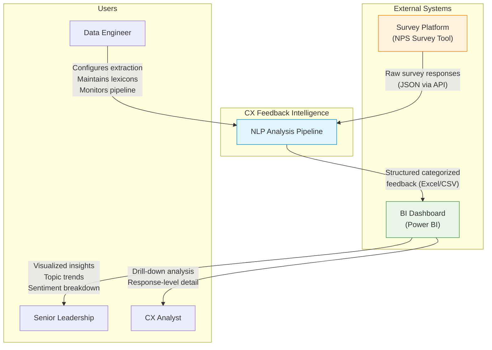

# System Context Diagram

Shows the CX Feedback Intelligence system in relation to its external actors and systems.

## Key Interactions

| From | To | Data | Frequency |
|---|---|---|---|
| Survey Platform | Pipeline | Raw NPS responses (JSON) | Batch per year/quarter |
| Pipeline | BI Dashboard | Categorized feedback (Excel) | After each pipeline run |
| Data Engineer | Pipeline | Lexicon updates, extraction config | As needed |
| BI Dashboard | Leadership | Aggregated insights, trends | On-demand |
| BI Dashboard | CX Analyst | Response-level drill-downs | On-demand |
